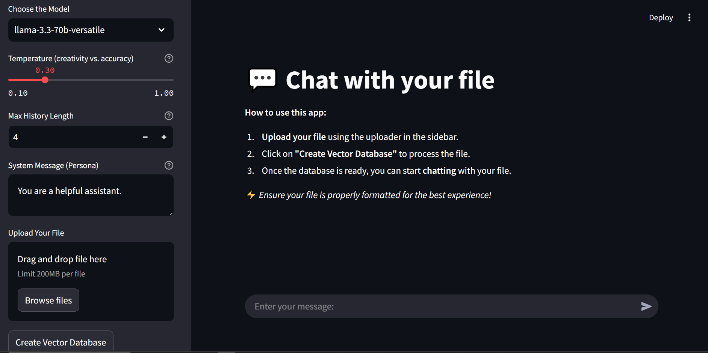

# 💬 Chat with Your File

This is a **Streamlit-based AI assistant** that allows you to **chat with your files**. It extracts text from various document types, stores it in a **vector database**, and retrieves relevant information to answer your queries intelligently. Powered by **LangChain, FAISS, and ChatGroq**, this app enhances document interaction using **state-of-the-art language models**.

## 🚀 Features

- **Supports multiple file formats**: `.docx`, `.pdf`, `.pptx`, `.xlsx`, `.txt`, `.png`, `.jpg`, etc.
- **Extracts text intelligently** using LLMWhisperer.
- **Creates a vector database** to enable semantic search.
- **Retrieves relevant context** for accurate responses.
- **Supports multiple AI models**: Llama 3, Qwen, Gemma, Mixtral.
- **Interactive chat experience** with streaming responses.
- **Customizable system persona** and chat settings.

## 📁 Supported File Formats

- **Documents**: `.docx`, `.doc`, `.pdf`, `.txt`, `.odt`
- **Presentations**: `.pptx`, `.ppt`, `.odp`
- **Spreadsheets**: `.xlsx`, `.xls`, `.ods`
- **Images**: `.png`, `.jpg`, `.jpeg`, `.gif`, `.tiff`, `.bmp`, `.webp`


## 🛠️ Installation

### Local Deployment

If you want to run this project locally, follow these steps:

1. Clone the repository:

   ```bash
   git clone https://github.com/abdoghazala7/chat-with-your-file.git
   cd chat-with-your-file

2. Create a virtual environment and install dependencies:
  - python -m venv venv
  - source venv/bin/activate  # On Windows: venv\Scripts\activate
  - pip install -r requirements.txt

3. Set up API keys:
  - LLMWhisperer: Add your key to secrets.toml or environment variables.
  - Groq API: Add your key to secrets.toml or environment variables.

4. Run the app with:

     ```bash
     streamlit run app.py


### Direct Usage:

If you don't want to deploy the project locally, you can access the live version directly:

- Visit the hosted application at: [Your Deployed App URL](https://your-deployed-app-url.com)

No setup is required—simply upload your file, create the vector database, and start chatting!

---------------------------------------------------------------------------------------------

## 🏃 Usage

### Upload a File:
- Use the sidebar to upload a supported file (e.g., PDF, Word, image).

### Create Vector Database:
- Click the "Create Vector Database" button to process the file and generate a vector database.

### Start Chatting:
- Enter your questions in the chat interface.
- The app retrieves relevant context from the vector database and provides informed responses.

## 🔧 Configuration

Customize chat settings via the sidebar:

- **Model selection**: Choose between different AI models.
- **Temperature**: Adjust for creativity vs. accuracy.
- **Max chat history**: Control conversation length.
- **System persona**: Define the AI’s behavior.

## 🤖 AI Models Supported

- **Llama-3.3-70b-versatile**
- **Qwen-2.5-32b**
- **Gemma2-9b-it**
- **Mixtral-8x7b-32768**

## 🛑 Limitations

- Large files may take longer to process.
- The accuracy of responses depends on text extraction quality.
- Some files might not be extractable due to formatting issues.

## 🙌 Acknowledgments

- **LangChain** for text processing.
- **FAISS** for vector search.
- **Streamlit** for UI.
- **HuggingFace** for embeddings.
- **LLMWhisperer & Groq** for AI-powered responses.


<h3 align="center">Chat UI</h3>

<p align="center">
  
</p>
